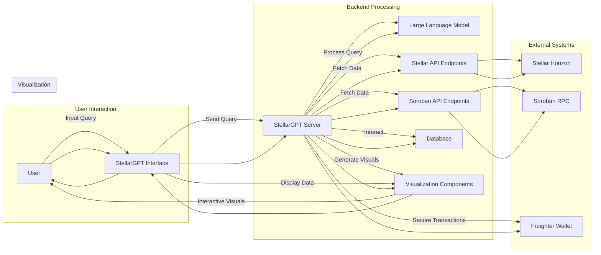
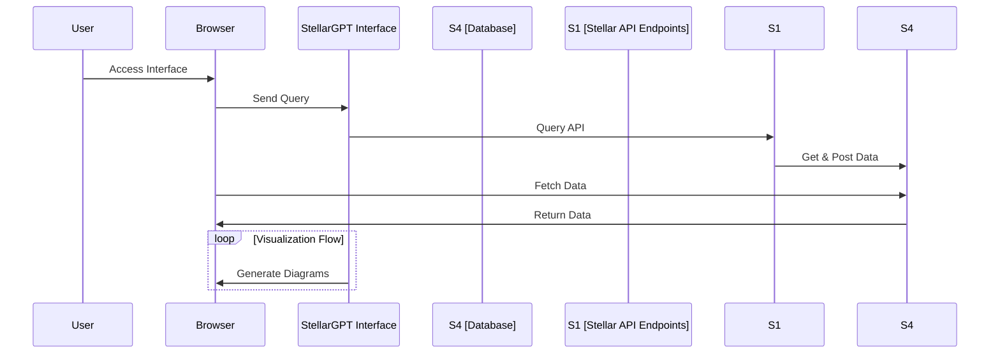

### Technical Architecture of StellarGPT v2.0

#### Introduction
StellarGPT v2.0 is an advanced AI-powered tool designed to enable users and developers to interact with on-chain data within the Stellar and Soroban ecosystems. The tool leverages natural language processing (NLP) to handle user queries and generates interactive visual representations of real-time on-chain data.

#### Detailed Technical Architecture

##### Components Overview
1. **LLM (Large Language Model) Integration**
2. **StellarGPT Interface**
3. **StellarGPT Server**
4. **Stellar and Soroban APIs**
5. **Freighter Wallet**
6. **Database Management**
7. **Visualization Components**

##### Architecture Components and Workflow

###### 1. LLM Integration
Users interact with StellarGPT v2.0 using natural language queries processed by a Large Language Model (LLM), such as OpenAI's GPT-4. This model interprets user inputs and generates appropriate API requests and visualization commands.

###### 2. StellarGPT Interface
The user interface (UI) provides a platform for users to input queries and visualize results. It communicates with the backend server to fetch data and render visualizations.

###### 3. StellarGPT Server
The backend server orchestrates the interaction between the UI, APIs, and the database. It processes user requests, fetches data from Stellar and Soroban APIs, and formats the data for visualization.

###### 4. Stellar and Soroban APIs
These APIs provide access to real-time on-chain data, including account details, transaction histories, and smart contract interactions.

###### 5. Freighter Wallet
The Freighter Wallet integrates for secure transaction signing and submission, ensuring user transactions are safely handled.

###### 6. Database Management
A centralized database (e.g., PostgreSQL) stores transaction data, ensuring efficient retrieval and real-time updates.

###### 7. Visualization Components
Interactive visual components (e.g., charts, diagrams) are generated based on the processed data, allowing users to engage with the data intuitively.

##### Detailed Workflow
1. **User Interaction**: Users input queries via the StellarGPT interface.
2. **Query Processing**: The LLM interprets these queries and translates them into API requests.
3. **Data Retrieval**: The StellarGPT server processes these requests, fetching required data from Stellar and Soroban APIs.
4. **Data Processing**: The server processes and formats the data for visualization.
5. **Visualization Generation**: Interactive visual components are generated and rendered in the UI.
6. **Transaction Management**: For operations requiring blockchain interactions, the Freighter Wallet handles secure transaction signing and submission.

### Mermaid Diagram for Technical Architecture



### Technical Code Snippets

##### Example: Query Processing and Data Fetching
```python
from flask import Flask, request, jsonify
from transformers import GPT2LMHeadModel, GPT2Tokenizer
import requests

app = Flask(__name__)

# Initialize the LLM (GPT-4 model)
tokenizer = GPT2Tokenizer.from_pretrained('gpt2')
model = GPT2LMHeadModel.from_pretrained('gpt2')

# Define API endpoints for Stellar and Soroban
STELLAR_API_ENDPOINT = "https://horizon.stellar.org"
SOROBAN_API_ENDPOINT = "https://rpc.soroban.org"

@app.route('/query', methods=['POST'])
def query():
    user_input = request.json['query']
    
    # Generate API request using LLM
    inputs = tokenizer.encode(user_input, return_tensors='pt')
    outputs = model.generate(inputs, max_length=150)
    query = tokenizer.decode(outputs[0], skip_special_tokens=True)
    
    # Fetch data from Stellar API
    stellar_response = requests.get(f"{STELLAR_API_ENDPOINT}/{query}")
    soroban_response = requests.get(f"{SOROBAN_API_ENDPOINT}/{query}")

    # Combine and process data
    data = {
        'stellar': stellar_response.json(),
        'soroban': soroban_response.json()
    }

    # Return processed data
    return jsonify(data)

if __name__ == '__main__':
    app.run(debug=True)
```

##### Example: Data Visualization Generation
```javascript
import React, { useState, useEffect } from 'react';
import axios from 'axios';
import { Chart } from 'react-google-charts';

const VisualizationComponent = () => {
  const [data, setData] = useState([]);

  useEffect(() => {
    const fetchData = async () => {
      const response = await axios.post('/query', { query: 'fetch account balances' });
      setData(response.data);
    };
    fetchData();
  }, []);

  return (
    <Chart
      chartType="PieChart"
      data={data}
      options={{
        title: 'Account Balances',
        is3D: true,
      }}
      width="100%"
      height="400px"
      legendToggle
    />
  );
};

export default VisualizationComponent;
```

### Conclusion
StellarGPT v2.0 integrates advanced NLP capabilities with real-time on-chain data from Stellar and Soroban to generate interactive visualizations, facilitating easier data interaction for developers, analysts, and business stakeholders. By leveraging the power of AI and robust API integrations, StellarGPT v2.0 enhances productivity and usability within the Stellar ecosystem.


