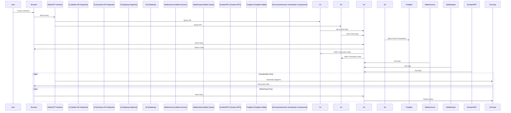

```mermaid
sequenceDiagram
    participant User
    participant Browser
    participant StellarGPT Interface
    participant S1 [Stellar API Endpoints]
    participant S2 [Soroban API Endpoints]
    participant S3 [Signing Endpoints]
    participant S4 [Database]
    participant StellarHorizon [Stellar Horizon]
    participant StellarExpert [Stellar Expert]
    participant SorobanRPC [Soroban RPC]
    participant Freighter [Freighter Wallet]
    participant VisComp [Interactive Visualization Components]

    User->>Browser: Access Interface
    Browser->>StellarGPT Interface: Send Query
    StellarGPT Interface->>S1: Query API
    StellarGPT Interface->>S2: Query API
    S1->>S4: Get & Post Data
    S2->>S4: Get & Post Data
    S3->>Freighter: Sign & Post Transactions
    Browser->>S4: Fetch Data
    S4->>Browser: Return Data
    S4->>S1: Write Transaction Data
    S4->>S2: Write Transaction Data
    StellarHorizon->>S4: Get Data
    StellarExpert->>S4: Get Data
    SorobanRPC->>S4: Get Data

    loop Visualization Flow
        StellarGPT Interface->>VisComp: Generate Diagrams
        VisComp->>Browser: Interactive Data
    end

    loop Refreshing Flow
        Browser->>S4: Fetch Data
        S4->>VisComp: Refresh Data
    end


```
