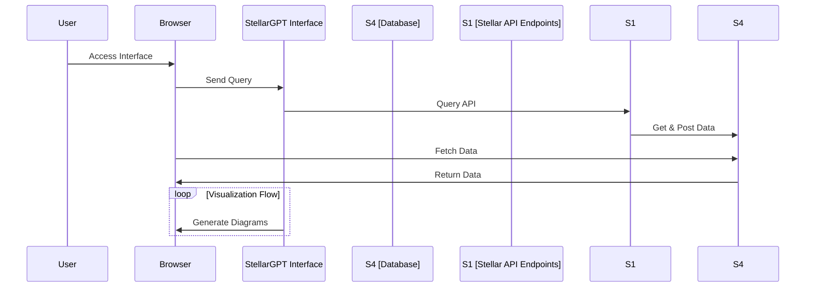

```mermaid
sequenceDiagram
    participant User
    participant Browser
    participant StellarGPT Interface
    participant S4 [Database]
    participant S1 [Stellar API Endpoints]

    User->>Browser: Access Interface
    Browser->>StellarGPT Interface: Send Query
    StellarGPT Interface->>S1: Query API
    S1->>S4: Get & Post Data
    Browser->>S4: Fetch Data
    S4->>Browser: Return Data

    loop Visualization Flow
        StellarGPT Interface->>Browser: Generate Diagrams
    end

```
